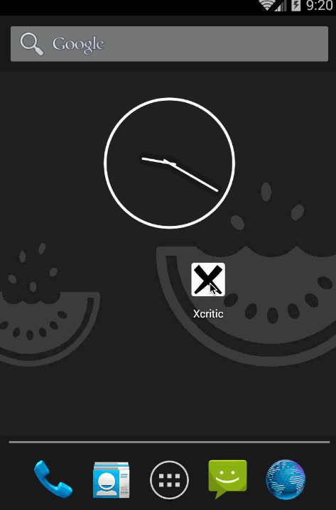

# Xcritic

## Summary

Xcritic is an Android app that lets you discover and evaluate movies, tv shows, music and games in just a couple of touches. It uses [Metacritic API](https://www.publicapis.com/byroredux/metacritic).

## Walkthrough



## Setup

- First run the following commands to avoid adding secret credentials into the git repo:

```bash
git update-index --assume-unchanged app/src/main/java/fantastic3/xcritic/configs/v2/MetacriticConfig.java
```

- Then feel free to add the secret credentials.

## User Stories

After living the process of using a `README.md` file to track the progress of the project, we decided to start using Github issues instead, as follows:

### Required

- [Required@github.com](../../issues?utf8=✓&q=is%3Aissue+label%3Arequired)
- [](http://waffle.io/Fantastic3/xcritic?search=required)

### Optional

- [Optional@github.com](../../issues?utf8=✓&q=is%3Aissue+label%3Aoptional)
- [](http://waffle.io/Fantastic3/xcritic?search=optional)

## Wireframes

- [Week 4](../../issues?utf8=✓&q=is%3Aissue+label%3Awireframe)
